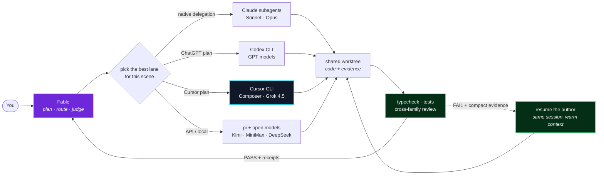

# unc-skills

Miguel's collection of portable Agent Skills for Claude Code, Codex, and pi.

[](https://skills.sh/miguelrios/unc-skills)

| Skill | What it does | Cross-harness note |
|---|---|---|
| [`hands-free`](hands-free/) | Calls your phone when the coding agent needs an answer or approval. | Same Python/Vapi contract in all three harnesses. |
| [`parable`](parable/) | Gives Fable a multi-model cast: plan, dispatch, verify, and cross-family review. | Runs Claude subagents plus Codex, Cursor, and pi executors; Cursor unlocks Composer and Grok 4.5. |
| [`cascade`](cascade/) | Runs large projects as bounded, evidence-gated development loops. | Falls back to a file-backed task graph when the harness has no task or wake primitives. |
| [`recall`](recall/) | Indexed local search over prior Claude Code and Codex sessions. | Runs from pi, but does not index pi's own transcripts yet. |
| [`tether`](tether/) | Keeps Slack threads attached to the exact agents that created them. | Codex and Claude Code resume natively; stock pi publishes as a headless run. End-to-end routing also installs an external Hermes plugin/runtime. |
| [`desloppify`](desloppify/) | Turns whole-codebase slop into evidence-backed cleanup with Peter O'Malley's official engine. | One canonical workflow selects honest native or prepared-packet review routes per harness. |

The skill payloads are canonical `skills/<name>/SKILL.md` directories. Harness-specific
manifests package those same files; there are no Claude/Codex/pi forks to drift apart.

## Fable directs. The cast ships.

[Parable](parable/) keeps Fable in the director's chair: it turns the request into precise
implementation plans, sends each scene to the best available harness, verifies the shared
worktree, and gives the final diff to a model that did not author it.



- **Composer through Cursor** for fast, precise implementation bursts.
- **Grok 4.5 through Cursor** for a genuinely different model family—especially useful for
  adversarial review when Claude and OpenAI agree a little too quickly.
- **Codex, Claude subagents, and pi/OpenAI-compatible models** for the rest of the cast, routed
  by task fit and live subscription headroom rather than a hard-coded model ladder.

See the [Parable README](parable/) for the full story and the
[three-subscription example cast](parable/examples/parable.cursor.toml) for a working config.

## Install with skills.sh

Browse all six skills at [skills.sh/miguelrios/unc-skills](https://skills.sh/miguelrios/unc-skills),
or install interactively:

```bash
npx skills add miguelrios/unc-skills
```

Install one directly with `--skill`:

```bash
npx skills add miguelrios/unc-skills --skill hands-free
npx skills add miguelrios/unc-skills --skill parable
npx skills add miguelrios/unc-skills --skill cascade
npx skills add miguelrios/unc-skills --skill recall
npx skills add miguelrios/unc-skills --skill tether
npx skills add miguelrios/unc-skills --skill desloppify
```

Add `--global` for a user-level install or `--agent claude-code`, `--agent codex`, or
`--agent pi` to choose a destination explicitly. The skills.sh CLI discovers the same canonical
payloads used by the native installs below; npm publication of the individual packages is not
required.

Tether also needs its external Hermes runtime. Install the complete bridge with:

```bash
npx --yes --package=github:miguelrios/unc-skills#main tether setup --harness=both
```

## Install for Claude Code

```bash
claude plugin marketplace add miguelrios/unc-skills
claude plugin install hands-free@unc-skills
claude plugin install parable@unc-skills
claude plugin install cascade@unc-skills
claude plugin install recall@unc-skills
claude plugin install tether@unc-skills
claude plugin install desloppify@unc-skills
```

Install only the skills you want. Start a new session after installation.

## Install for Codex

```bash
codex plugin marketplace add miguelrios/unc-skills
codex plugin add hands-free@unc-skills
codex plugin add parable@unc-skills
codex plugin add cascade@unc-skills
codex plugin add recall@unc-skills
codex plugin add tether@unc-skills
codex plugin add desloppify@unc-skills
```

Codex uses the native `.agents/plugins/marketplace.json` and package
`.codex-plugin/plugin.json` manifests. Start a new session after installation.

## Install for pi

```bash
pi install git:github.com/miguelrios/unc-skills
```

The repository is one pi package that exposes all six skills. In pi, invoke one explicitly
with `/skill:hands-free`, `/skill:parable`, `/skill:cascade`, `/skill:recall`, or
`/skill:tether`, or `/skill:desloppify`.

## Compatibility evidence

The local gate runs all six skills across the three harnesses for native installation,
discovery, and credential-free smoke checks. The original four-skill portability campaign is
archived in its [matrix](docs/evidence/L4-clean-home-matrix/matrix.md),
[research](docs/evidence/L0-portability-baseline/research.md), and
[final verdict](docs/evidence/L5-portability-verdict/VERDICT.md).

Run the local gate with:

```bash
npm test
for package in hands-free parable cascade recall tether desloppify; do (cd "$package" && npm test); done
python3 scripts/prove_portability.py --output /tmp/unc-skills-portability
```
