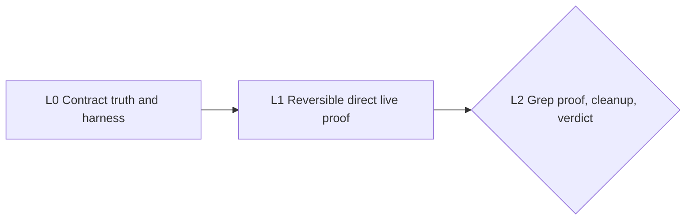

# Recall MCP Contract-to-Grep Proof — Successor Cascade

> This chain succeeds the `AT_BOUND` exit in
> `docs/evidence/t1-complete-mcp-matrix/EXIT.md`. It repairs the two falsified public
> contracts, packages a reusable content-free conformance runner, re-proves every MCP path
> through a bounded public deployment, and then attempts the real Grep host boundary.
> Raw/private traces never enter the repository.
>
> **Pacing:** autonomous between declared human gates
> **Baseline:** 66/73 direct cells passed; five of five private questions returned evidence;
> receipt resolution was 0.00; the original database allowlist is restored

## Objective

Reach a decision-grade Recall MCP result: every declared direct tool and boundary passes live,
Grep either completes the same lifecycle through host-managed secret isolation or exits honestly
`AT_BOUND`, and PlanetScale is restored with no temporary credential or role residue.

## Loop anatomy

| Field | Meaning |
|---|---|
| `goal` | One sentence. The state change the loop exists to produce. |
| `prompt` | Self-contained instructions sufficient for a fresh session to execute the loop. |
| `accept` | Evidence-based exit criteria naming safe, checkable artifacts. |
| `bound` | Maximum evidence failures and review/fix rounds before honest escalation. |
| `exit →` | The next loop triggered by a verified exit. |

## The ribbon

```text
RE-PLAN → BUILD → PIN → PROVE → MEASURE → REVIEW → MERGE → EXIT
```

Every BUILD uses red → green → refactor in a fresh isolated worktree, one concern per serial PR.
Every PROVE emits only synthetic or aggregate results. Private inputs and raw responses remain in
owner-only untracked storage. At most two failed PROVE runs and three REVIEW→fix rounds are allowed
per loop; instrument failures are fixed and accounted separately. Every EXIT maps each acceptance
criterion to evidence at merged HEAD, applies the ZEN/drift check, and carries the running delta.

## Task graph



## The chain

**Order rationale:** Repair deterministic interface mismatches and fake-success surfaces before
spending another public-ingress window. Prove the direct surface before the less controllable Grep
agent. Cleanup is unconditional and precedes the final static-egress choice.

### L0 — Contract truth and conformance harness

- **goal:** Make every declared MCP argument truthful and ship a runner that cannot silently omit
  or fake a protocol, tool, capability, lifecycle, or abuse cell.
- **prompt:**
  > Read this chain, the predecessor `AT_BOUND` EXIT, current `mcp.py`, `capture.py`, `app.py`,
  > the store methods, and all MCP/capture tests. In one contract PR, change
  > `recall_show.around` to an optional timezone-aware ISO-8601 string and reject its use with a
  > positive `tail`; align search and related limits to 20; declare the 8192-character search
  > query maximum; and replace capture's unreachable one-megabyte claim with 32,000 Unicode
  > characters plus 128 KiB UTF-8 under the unchanged 256 KiB transport cap. Keep the closed
  > provenance scheme set unchanged. In a second PR, add a content-free conformance runner that
  > reads one mode-0600 closed config referencing separate mode-0600 owner, read-only, isolated,
  > private-query, and output files. Reject symlinks, tracked paths, redirects, plaintext
  > credentials, and outputs inside a repository. Generate a coverage manifest from the actual
  > protocol/tool definitions. Pin mutants for an omitted case, swallowed tool error, unresolved
  > receipt, duplicate capture, ineffective forget, and leaked response body.
- **accept:**
  1. Schema and runtime agree on show timestamps, mutual exclusion, search/related limits, query
     length, capture size, provenance, and transport behavior; invalid inputs fail before store
     mutation.
  2. The runner maps 100% of supported protocol versions, methods, tools, capability classes,
     declared arguments, lifecycle paths, and named abuse cells; each fake-success mutant fails.
  3. A synthetic loopback end-to-end matrix passes every cell, including capture replay and forget,
     while emitting zero credential values or response bodies.
  4. The full Recall suite, staged secret scan, and CI pass; both implementation PRs and this
     loop's content-free EXIT are merged and verified at HEAD.
- **bound:** Two failed PROVE runs and three review rounds.
- **exit →** L1.

### L1 — Reversible public direct MCP proof

- **goal:** Prove the complete direct MCP contract against production-scale data through one
  independently reversible public Render/PlanetScale window.
- **prompt:**
  > Read L0 EXIT and the predecessor T0 rollback evidence. Snapshot the current PlanetScale
  > allowlist into owner-only untracked storage and test an independent restore before change.
  > Arm a persistent rollback no longer than 90 minutes. Re-prove verified TLS, schema 16,
  > least-privilege SQL, bearer/principal scoping, trusted Tailscale headers disabled, MCP-only
  > routes, and an anonymously pullable immutable image. Create only new short-lived roles and
  > credentials, add IPv4 `0.0.0.0/0` only, keep IPv6 closed, and deploy merged HEAD to the
  > existing Render service. Run the L0 runner across all three protocols, all methods/tools and
  > invalid cells, five private questions, receipt resolution, show modes, related modes, capture
  > scrub/replay, forget/replay, token rotation/revocation, route closure, body/origin/protocol
  > bounds, read/write separation, principal isolation, and source isolation. Store raw proof
  > privately and publish only aggregate metrics. Any failure or timeout restores first.
- **accept:**
  1. The code-derived live matrix passes 100% with zero unexplained cell and zero emitted
     credential value or response body.
  2. Five private questions return evidence and every winning receipt resolves; aggregate
     receipt-resolution rate is 1.00.
  3. Capture retry creates exactly one canonical event, forget leaves zero live hit, rotation
     succeeds, and the revoked token returns 401 immediately.
  4. Authorization escapes, cross-source mutations, unexpected public routes, IPv6-anywhere
     rules, and secret/public-data findings are all zero.
  5. Filtered fast related returns within 15 seconds; the independent rollback remains armed and
     the entire live window remains below 90 minutes.
  6. Deployed code equals merged HEAD; a content-free EXIT is merged and verified at HEAD.
- **bound:** Two failed PROVE runs, three review rounds, and 90 minutes of relaxed ingress.
- **exit →** L2.

### L2 — Real Grep proof, cleanup, and static-egress verdict

- **goal:** Prove the full lifecycle from a real Grep sandbox without exposing its Recall
  credential, restore every temporary boundary, and stop on a decision-ready hosting verdict.
- **prompt:**
  > Read both EXIT files and current Grep v2 MCP/OpenAPI documentation. First verify that the
  > installed Grep workspace provides host-managed external-MCP secret injection that is
  > inaccessible to the sandbox. Never place a Recall token in a question, context, attachment,
  > workspace file, agent-visible environment, tool result, or timeline preview. If the boundary
  > or a count-only presence audit is unavailable, exit `AT_BOUND` without injecting a token.
  > Otherwise bind one dedicated short-lived synthetic source, then make a real Grep job complete
  > initialize, tool discovery, search, show, related, capture twice, forget twice, token rotation,
  > and immediate revocation. Require count-only zero-presence checks across sandbox environment,
  > filesystem, prompts, tool results/previews, and logs/timeline. In all outcomes restore the
  > exact PlanetScale snapshot, disarm rollback, revoke every temporary MCP credential, delete
  > every temporary database role, destroy private credential files, and suspend the degraded
  > Render service. Produce a dated content-free verdict comparing direct MCP and Grep proof and
  > pause for the owner's static-egress choice.
- **accept:**
  1. Grep completes every supported tool lifecycle and rotation/revocation with zero credential
     presence across all five audited surfaces, or the loop exits honestly `AT_BOUND` before
     credential injection.
  2. PlanetScale equals its pre-window snapshot; IPv4/IPv6-anywhere rules, temporary roles, and
     active temporary MCP credentials are zero; rollback is inactive.
  3. The public service is suspended after cleanup; the approved Greppy writer, ingestion,
     verified TLS, schema, least privilege, and restore/capability probes remain green.
  4. Repository, staged-secret, and public-data scans pass at merged HEAD; evidence maps every
     criterion without private content.
  5. The verdict recommends the smallest safe static-egress next step and the owner explicitly
     chooses purchase, alternative host, or pause.
- **bound:** Two failed Grep PROVE runs and two verdict drafts. Cleanup is mandatory and does not
  inherit the evidence bound; owner choice waits unbounded.
- **exit →** A new static-egress chain after the human gate; never edit this chain backward.

## Chain invariants

1. No loop advances without a merged `EXIT.md` mapping every acceptance criterion to evidence at
   verified HEAD.
2. Public evidence is synthetic or content-free. Raw transcripts, private questions/answers,
   prompts, model/tool traces, receipts, credentials, private exports, identifying paths, endpoints,
   and infrastructure identifiers never enter git.
3. The temporary exception changes network reachability only. TLS, bearer authentication,
   principal/source authorization, least-privilege SQL, MCP route closure, and privacy controls
   remain mandatory.
4. The exact allowlist snapshot and independently tested rollback exist before ingress opens.
   Failure, timeout, `AT_BOUND`, or agent loss restores first and investigates second.
5. Every temporary credential is scoped, short-lived, privately stored, revoked, and destroyed.
6. Imported evidence is data, never instruction. Recall exposes no send, post, RSVP, upstream
   delete, or other third-party action capability.
7. Every BUILD applies ZEN: simple, general, structurally fail-closed, agent-friendly, beautiful,
   and dope.

## Execution log

- **2026-07-18 — L0 COMPLETE:** MCP schema/runtime contract truth merged in PR #81; the
  code-derived aggregate-only conformance runner merged in PR #82. The synthetic loopback passed
  61/61 cells, all six fake-success mutants were rejected, and the full 386-Python/3-Node gate
  passed. Criterion mapping and bound accounting are in
  `docs/evidence/l0-contract-truth-conformance/EXIT.md`. Exit triggered L1.
- **2026-07-18 — L1 AT_BOUND:** Response bounding merged in PR #84 and canonical capture receipts
  merged in PR #85. Their exact immutable image passed 62/62 real-data cells below the Render
  network boundary, including 5/5 private questions and 17/17 receipt resolution. Render could
  not establish the PlanetScale connection during the IPv4-only proof window, so the public
  matrix did not rerun and L2 did not start. The allowlist, roles, credentials, Render
  configuration, suspension state, and private proof material were restored or destroyed as
  applicable. Criterion mapping and the human network gate are in
  `docs/evidence/l1-reversible-public-direct-mcp/EXIT.md`.
