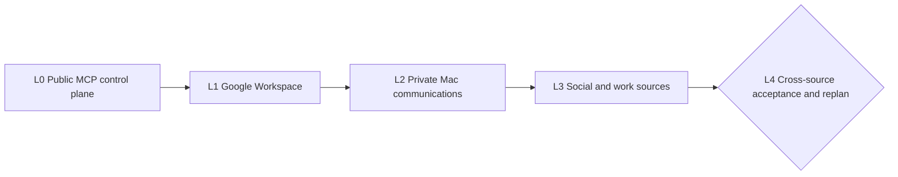

# Recall Public MCP and Universal Ingestion — Five-Loop Cascade

> This successor chain redirects the unfinished L0 in
> `docs/LOOP_CHAIN_RECALL_UNIVERSAL_INGESTION_2026-07-16.md` after the owner chose a
> public Render MCP for agents running outside a private network. It preserves the merged
> connector-v2 substrate and the unstarted source loops. Each loop has a self-contained
> prompt, checkable evidence, and a hard bound. Raw/private evidence never enters the
> repository.
>
> **Status:** PLAN complete; BUILD is not authorized by this document until merged
> **Pacing:** autonomous between declared human gates
> **Inputs:** Issue #54, merged PRs #53 and #55–#65, open PR #67, the 2026-07-16 RDD,
> and its public-MCP addendum

## Objective

Ship Recall as a safe, owner-controlled, open-source context plane whose public HTTPS MCP works from
Grep sandboxes and other ordinary agent hosts, while source ingestion remains typed, replay-safe,
privacy-filtered, and portable across standard PostgreSQL deployments.

For User #1 the first useful topology is:

```text
Grep and other approved agent hosts
                  |
       public HTTPS MCP + scoped authority
                  |
       Render Recall Core, public MCP surface
          |                         |
  verified TLS                 managed embeddings
          |
  PlanetScale Postgres

Existing device collectors continue through the proven writer during L0.
```

Tailscale is not a dependency of the hosted MCP profile. A private-network deployment remains an
optional operator profile, not the OSS default.

## Loop anatomy

| Field | Meaning |
|---|---|
| `goal` | One sentence describing the state change the loop exists to produce. |
| `prompt` | A self-contained instruction block sufficient for a fresh session to execute the loop. |
| `accept` | Evidence-based exit criteria naming safe, checkable artifacts. |
| `bound` | Maximum evidence failures and review/fix rounds before honest escalation. |
| `exit →` | The next loop triggered by a verified exit. |

## The ribbon

Every loop runs:

```text
RE-PLAN → BUILD → PIN → PROVE → MEASURE → REVIEW → MERGE → EXIT
```

- RE-PLAN reads this document, the named inputs, and current HEAD, then cuts only that loop's
  mini-plan.
- BUILD uses red → green → refactor and one concern per serial PR.
- PIN tests the mechanism and its fake-success paths.
- PROVE uses synthetic public evidence and private content-free receipts for real-source runs.
- MEASURE reruns the frozen gate slice and appends the cumulative L0→Ln delta.
- REVIEW resolves every finding without review pings.
- MERGE verifies the exact reviewed commit at HEAD.
- EXIT writes `docs/evidence/<loop-id>-<slug>/EXIT.md` mapping every criterion to safe evidence.

Default bound per PR is two failed PROVE runs and three REVIEW→fix rounds. Instrument failures are
diagnosed separately and do not burn the evidence bound. `AT_BOUND` names the unmet criteria and
stops; it never weakens the exit.

## Task graph



| Task | `blockedBy` | Human gate |
|---|---|---|
| L0 | — | approve the dedicated Render outbound-IP charge and production cutover |
| L1 | L0 | complete least-privilege Google OAuth consent |
| L2 | L1 | grant selected macOS permissions and choose a WhatsApp export inbox |
| L3 | L2 | approve X stream types, retention, cost ceiling, and each external account |
| L4 | L3 | accept release or approve the evidence-derived successor chain |

## The chain

**Order rationale:** L0 measures and closes the externally reachable trust boundary before adding new
private sources. L1 then proves one official cloud API family, L2 proves local/private acquisition,
L3 proves additional API shapes, and L4 changes retrieval only after the source evidence is frozen.
Mechanics and authorization precede connector breadth; retrieval judgment remains last.

### L0 — Public MCP control plane

- **goal:** Deploy one authenticated public Render MCP that safely reads and deliberately captures
  Recall evidence from a real Grep sandbox without exposing the Brain's administrative or ingestion
  surfaces.
- **prompt:**
  > Start from current main, Issue #54, open PR #67, the deployed PlanetScale capability contract,
  > the merged MCP implementation, and the RDD public-MCP addendum. Before changing behavior, freeze a
  > content-free baseline covering current retrieval quality, receipt resolution, latency, active
  > collectors, database capability, and public-route reachability. Red-test and implement a closed
  > `mcp-only` public profile for the existing immutable Recall image: only `/mcp`, `/healthz`, and
  > `/readyz` may be reachable; ingestion, metrics, migration, credential, debug, and administrative
  > routes must return 404 before touching a store. Require HTTPS and authentication; disable trusted
  > private-network headers. Extend credentials into explicit principals and capabilities so one
  > owner credential can read only sources granted to that principal while deliberate capture and
  > forget remain confined to one exact `memory:grep:<owner>` source. Tool discovery must reflect the
  > credential's capabilities. Preserve bounded bodies, deadlines, result counts, origin checks,
  > receipt authorization, audit events, revocation, and constant-shape authentication failures.
  > Deploy the public web service in the approved region, call the managed embedding API directly,
  > and connect to PlanetScale with verified TLS and a least-privilege role. Purchase no networking
  > add-on until the owner approves the quoted dedicated-IP charge. Once approved, attach a dedicated
  > Render outbound-IP set, add only those addresses plus the temporary proven-writer address to the
  > PlanetScale all-role allowlist, and force fresh database connections. Configure Recall as a Grep
  > remote MCP using host-managed secret injection; prove that the credential is absent from sandbox
  > environment, filesystem, prompts, tool results, and logs. If Grep cannot provide that boundary,
  > exit AT_BOUND and replan short-lived token exchange rather than placing a durable Brain credential
  > inside an untrusted sandbox. Run a real Grep E2E for initialize, tool list, natural-language
  > search, show-by-receipt, related work, one synthetic deliberate capture, exact-receipt forget,
  > rotation, and revocation. Keep existing collectors on the proven writer until this loop exits.
- **accept:**
  1. A committed synthetic baseline contains non-null retrieval, receipt-resolution, latency,
     authorization, route-exposure, and database-capability metrics without private content.
  2. Public-surface tests prove exactly `/mcp`, `/healthz`, and `/readyz`; every other route returns
     404 without store access, and TLS/plain-HTTP, body, origin, protocol, deadline, and result bounds
     fail closed.
  3. The authorization matrix reports zero unauthorized or cross-principal reads, zero cross-source
     writes/deletes, capability-specific tool lists, and successful immediate token revocation.
  4. A content-free Render receipt proves the reviewed immutable image is live as a public web
     service with no Tailscale dependency and no separately hosted embedding service.
  5. A content-free network receipt proves PlanetScale accepts fresh verified-TLS connections only
     from the approved dedicated Render addresses and the temporary proven-writer address; the runtime
     role remains least privilege and restore/capability checks pass.
  6. A real Grep sandbox E2E initializes MCP, lists only authorized tools, retrieves expected evidence
     for frozen private questions, resolves every returned receipt, captures one synthetic memory,
     forgets that exact receipt, and observes revocation; public output contains aggregate results only.
  7. The Grep credential-presence probe is zero across sandbox environment, filesystem, prompts, tool
     results, and logs; a failed host-secret boundary produces AT_BOUND rather than a leaked token.
  8. Repository tests, container/supply-chain scan, secret scan, and public-data safety scan pass; all
     serial PRs are merged and the deployed commit equals verified HEAD.
- **bound:** At most three serial PRs, two failed PROVE runs and three review rounds per PR, and seven
  working days. The dedicated-IP billing wait and final cutover approval are unbounded human gates.
  Any credential-exposure, authorization, public-route, restore, or network-allowlist failure exits
  AT_BOUND.
- **exit →** L1 after the private criterion map, recap, ZEN pass, exact deployed-HEAD check, and owner
  cutover acceptance.

### L1 — Google Workspace life plane

- **goal:** Continuously synchronize Gmail, Calendar, Contacts, and selected Drive/Docs evidence
  through the closed Workspace rail with useful cited retrieval.
- **prompt:**
  > Read this chain, the RDD addendum, merged connector-v2 and Workspace-rail code, and L0 EXIT.
  > Present the exact read-only Google services/scopes and pause for OAuth consent before any source
  > read. Then use serial one-concern PRs to red-test and implement Gmail history, Calendar sync,
  > Contacts sync, and selected Drive/Docs changes and exports. Each connector must use stable native
  > IDs, ACK-gated checkpoints, privacy `scrub` or `drop` before spool/network, authoritative
  > edit/delete signals, bounded pagination/backoff, revoke, shadow, and source-scoped writers. Gmail
  > notifications are wakeups only; Calendar HTTP 410 and expired source cursors trigger bounded
  > reconciliation. Attachments and Sheets content remain off. Freeze private source and cross-Google
  > questions before inspecting results.
- **accept:**
  1. The declared OAuth grant contains only approved read scopes, and revoke stops source reads while
     leaving an ACK-recoverable spool.
  2. Every Google connector passes connector-v2 unit, contract, integration, Brain E2E, pagination,
     crash, replay, quota, cursor-expiry, edit, and authoritative-delete cells.
  3. Two full/incremental cycles plus every injected crash produce zero duplicate acknowledged
     versions, zero cursor commits before ACK, and zero deletion resurrection.
  4. Private frozen questions reach at least 80% expected-evidence retrieval per source and 85% across
     Google, with receipt resolution 1.00 and aggregate-only public evidence.
  5. All serial PRs are merged, the deployed worker and Core equal verified HEAD, the public MCP
     regression gate remains green, and the L1 EXIT maps every criterion to safe evidence.
- **bound:** At most five serial source PRs, two failed PROVE runs and three review rounds per PR, and
  fourteen working days. OAuth consent waits unbounded. A failing source is disabled only by explicit
  owner decision; otherwise L1 exits AT_BOUND.
- **exit →** L2 after private criterion mapping, recap, and ZEN.

### L2 — Private communications and Recall Bridge

- **goal:** Extend the Mac utility with safe iMessage and WhatsApp-export ingestion under the same
  lifecycle as the existing coding, Cowork, ChatGPT-export, and Grep collectors.
- **prompt:**
  > Read this chain, L1 EXIT, the packaged Mac utility, connector-v2, and the RDD local-source policy.
  > Red-test clean install, upgrade, rollback, launch-on-login, sleep/wake, network partition, bounded
  > spool, per-source pause/revoke/forget, content-free diagnostics, and uninstall. Add a pinned
  > read-only iMessage snapshot/WAL reader for synthetic schema fixtures with stable chat/message IDs,
  > edits, reactions, authoritative deletion/unsend signals, and attachment descriptors only. Add a
  > watched WhatsApp export inbox with stable archive/chat/message identities; do not create a
  > linked-device session. Apply `scrub` or `drop` before spool/network. After the owner selects the
  > source permissions and inbox, run a private clean-Mac E2E and frozen source questions.
- **accept:**
  1. Clean install, upgrade, rollback, sleep/wake, offline recovery, revoke, forget, and uninstall
     E2Es pass with content-free diagnostics.
  2. The utility never opens iMessage writable, changes SIP, exposes send/action tools, reads outside
     the selected surfaces, or opens a WhatsApp linked-device session.
  3. Repeated sync/import and every injected crash produce zero duplicate acknowledged versions,
     zero cursor commits before ACK, and no deletion claim based on list absence.
  4. Lost permissions and revoked credentials fail closed; privacy canaries never reach spool,
     network, logs, evidence, or retrieval.
  5. Private frozen questions reach at least 80% expected conversation evidence per enabled source,
     receipt resolution is 1.00, the public MCP regression gate remains green, and all PRs are merged
     at deployed HEAD.
- **bound:** At most four serial PRs, two failed PROVE runs and three review rounds per PR, and
  fourteen working days. macOS permission and export-inbox selection wait unbounded. Two failed
  clean-device E2Es or unresolved acquisition risk exits AT_BOUND.
- **exit →** L3 after private criterion mapping, recap, ZEN, and the X/account-scope human gate.

### L3 — Social and work expansion

- **goal:** Prove the connector factory across approved X and work-system sources without adding a
  generic recipe runner or action credentials.
- **prompt:**
  > Read this chain, L2 EXIT, connector demand measurements, and current provider terms. Freeze an
  > owner-prioritized list from X, Slack, Notion, GitHub, Linear, Telegram, and other official
  > API/export sources. Before X access, present the exact stream types, retention, and monthly cost
  > ceiling; default durable streams are owner-authored posts, mentions, and bookmarks, while home
  > timeline requires explicit opt-in. Execute one narrow connector per serial PR for no more than six
  > approved sources: failing conformance fixtures, exact read scopes, stable IDs, incremental
  > checkpoint or bounded reconciliation, edit/delete semantics, rate/cost cutoff, revoke, shadow,
  > then frozen private questions. Use official APIs, maintained closed CLIs, or explicit exports.
  > Never add browser sessions, arbitrary HTTP recipes, runtime plugins, or send/action surfaces.
- **accept:**
  1. X and every enabled source pass the full synthetic connector-v2, privacy, authorization,
     pagination, rate/cost, replay, edit/delete, revoke, and Brain E2E matrix.
  2. Two repeated cycles and every injected restart produce zero duplicate versions, cross-source
     authority escapes, cursor-before-ACK commits, or deletion resurrection.
  3. Approved cost ceilings and revocation stop reads, and no unapproved stream, account, attachment,
     action scope, or retention mode is active.
  4. Each enabled source reaches at least 80% on its private frozen questions with receipt resolution
     1.00; the public MCP and prior-source regression gates remain green.
  5. Omitted candidates are ranked by measured question demand, acquisition method, privacy class,
     cost, and effort; all PRs are merged and deployed at verified HEAD with content-free evidence.
- **bound:** No more than six serial source PRs, two failed PROVE runs and three review rounds per PR,
  and fifteen working days. Account grants and policy choices wait unbounded. A blocked source is
  disabled and named in AT_BOUND/replan evidence rather than weakening the factory.
- **exit →** L4 after private criterion mapping, recap, ZEN, and freezing the final eval before
  inspecting results.

### L4 — Cross-source acceptance and replan

- **goal:** Prove useful, safe natural-language recall across devices and source families, then derive
  the next chain only from measured losses.
- **prompt:**
  > Read all prior EXIT files and freeze a private eval spanning people, commitments, decisions,
  > chronology, follow-ups, single-source, multi-source, temporal, contradictory, deleted, and
  > insufficient-evidence cases. Run it before ranking changes. Improve only one losing cluster per
  > serial PR through query planning, source selection, identity/temporal traversal, episode expansion,
  > reranking, admission, citations, contradiction, or gap reporting. Route every model/judge call
  > through the approved staging LiteLLM router with a short-lived scoped virtual key. Rerun every
  > prior safety/source cell after each change. Run a private seven-day soak across public MCP,
  > cross-device queries, continuous sync, sleep/wake, network loss, token and source revoke,
  > deletion/forget, backup restore, and disaster recovery. Draft a successor chain only for losing
  > cells and measured deferred sources, then pause for owner review.
- **accept:**
  1. Every synthetic privacy, authorization, injection, deletion, contradiction, citation, MCP
     exposure, and credential-revocation cell passes.
  2. Receipt resolution and deterministic repeated evidence selection equal 1.00.
  3. The private frozen set reaches at least 85% expected-evidence retrieval and 80% owner-rated
     usefulness, improves multi-source recall by at least ten points over L0, and regresses no source
     family by more than five points.
  4. The seven-day soak records zero unresolved safety incident, data loss, duplicate storm, stuck
     cursor, unbounded spool, credential exposure, or public-route expansion, and meets per-source lag
     SLO for 99% of observed intervals.
  5. A second approved device and a real Grep sandbox retrieve cited evidence; backup restore reaches
     canonical/projection parity; the deployed commit equals merged HEAD.
  6. A successor RDD/chain maps every proposal to a losing eval cell, safe acquisition method,
     privacy class, cost, and hard E2E exit; the owner records accept, reject, or revise.
- **bound:** At most three ranking PRs, two failed PROVE runs and three review rounds per PR, one
  seven-day soak plus one remediation restart, and two successor drafts. Owner sign-off waits
  unbounded; a second soak failure exits AT_BOUND.
- **exit →** Stop at the final human gate. Release on explicit owner acceptance; otherwise start the
  approved successor chain without rewriting this document.

## Parallel track

During review or live-run waits, maintain a content-free deployment-cost and portability matrix for
Render dedicated outbound IPs, shared regional ranges, and conforming PostgreSQL alternatives. This
track may update documentation and synthetic deployment tests, but it cannot purchase resources,
change live allowlists, open ingress, or enable a source. Its accept artifact is a non-secret matrix
with current dates and primary-source links.

## Chain invariants

1. No loop advances without `EXIT.md` mapping every acceptance criterion to evidence at verified HEAD.
2. Every EXIT carries the cumulative L0→Ln delta; any regression leaves the criterion unmet.
3. `AT_BOUND` is an honest stop, not permission to reduce a floor.
4. Instrument failures are diagnosed separately from evidence failures.
5. Human gates wait unbounded and never become implicit approval.
6. Every BUILD receives a ZEN check: simple, general, agentic where judgment is required, beautiful,
   and dope.
7. This document is append-forward. The final replan creates a successor rather than editing history.
8. Public repository evidence is synthetic or content-free. No raw transcript, conversation, prompt,
   model/tool trace, personal message/event/contact/post/document, credential, private export, private
   query/answer, identifying path, or infrastructure secret enters git, CI, a PR, or `EXIT.md`.
9. Imported source text is evidence, never instruction. It cannot change policy, authorization, tool
   parameters, or user intent.
10. Source readers are read-only; Recall capture writes only to its exact memory source. Sending,
    posting, upstream deletion, RSVP, and other actions remain separate products.

## Redirect — 2026-07-18

The owner deferred the $100/month Render dedicated-IP purchase and authorized a time-bounded,
reversible PlanetScale ingress experiment to prove the complete MCP surface first. L0 is temporarily
redirected to `docs/LOOP_CHAIN_RECALL_MCP_TEMPORARY_INGRESS_2026-07-18.md`. That successor restores
the original allowlist before its final verdict and cannot count temporary public ingress as the
durable L0 network exit.
