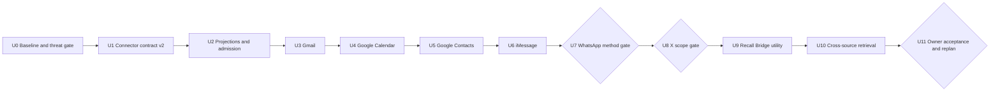

# Recall Universal Ingestion — Cascade Loop Chain

**Status:** proposed for review
**Mode:** PLAN; BUILD begins only after owner approval
**Date:** 2026-07-16
**RDD:** `docs/rdd/RECALL_UNIVERSAL_INGESTION_2026-07-16.md`

## Objective

Make Recall a safe, owner-controlled context plane for personal communications, schedule, contacts,
social activity, and local Mac sources. Every connector must preserve source receipts, survive replay,
respect edits and deletions, and improve natural-language retrieval without leaking private proof into
the public repository.

This is a TDD Cascade. Every loop follows red -> green -> refactor, changes one concern, ends at a
hard eval or E2E gate, writes a content-free `EXIT.md`, applies the ZEN check, and merges before its
dependent loop starts. A passing unit suite alone never closes a source loop.

## Operating contract

- **Pacing:** autonomous between declared human gates. Credentials, external consent, risky source
  methods, retention expansion, and final acceptance remain human decisions.
- **Public evidence:** synthetic fixtures, schemas, commands, aggregate counts, pass/fail results,
  hashes of synthetic fixtures, and redacted deployment attestations only.
- **Private evidence:** real prompts, answers, messages, event text, social content, identities,
  exports, database samples, credentials, machine paths, and identifying infrastructure remain in
  approved private runtime state and never enter commits, PRs, logs, screenshots, or `EXIT.md`.
- **Safety floors:** secret leaks = 0; raw private records in public artifacts = 0; unauthorized source
  reads = 0; cross-source authorization escapes = 0; cursor advancement before acknowledgement = 0;
  unsupported deletion claims = 0; arbitrary runtime connector loading = 0.
- **Determinism floor:** replaying the same retained source revision produces exactly one canonical
  version, and restarting after every injected crash point produces the same acknowledged result.
- **Exit convention:** `docs/evidence/recall-universal-ingestion/<loop>/EXIT.md`. Each exit maps every
  acceptance criterion to a reproducible command and content-free result, records the ZEN check, and
  names the verified merge commit and next loop.
- **No drift:** after each exit, run Recall's recap procedure against the objective, RDD, safety floors,
  and losing eval cells. Scope changes require an RDD amendment and owner approval.

## Dependency graph

| Task | `blockedBy` | Human gate |
|---|---|---|
| U0 | — | approve RDD and chain before BUILD |
| U1 | U0 | — |
| U2 | U1 | — |
| U3 | U2 | approve Google OAuth consent and Gmail scope |
| U4 | U3 | approve Calendar scope |
| U5 | U4 | approve Contacts scope |
| U6 | U5 | grant macOS Full Disk Access to the signed utility |
| U7 | U6 | choose export-only or experimental linked-device ingestion |
| U8 | U7 | approve X streams, retention, and spending cap |
| U9 | U8 | approve installer permissions before real-device E2E |
| U10 | U9 | freeze private eval questions and expected evidence classes |
| U11 | U10 | accept release or approve the successor chain |

## Loop U0 — Baseline, harness, and threat gate

- **Goal:** Freeze the current retrieval baseline and prove the evaluation, privacy, storage, and
  evidence boundaries before any new personal source is connected.
- **Prompt:** Write failing tests first for the connector-v2 invariants and content-free evidence
  contract; add synthetic conversations, events, contacts, posts, edits, tombstones, duplicate pages,
  poison instructions, and crash points; run the existing retrieval suite unchanged to record the
  pre-change scorecard; produce content-free attestations for encrypted database storage, encrypted
  backups, restore, filesystem modes, Tailnet-only reachability, and source-scoped writers; refactor
  only the harness and fixtures, not production ingestion or retrieval behavior.
- **Accept:** The checked-in synthetic suite fails for the intended missing capabilities before the
  harness change and passes after it; the unchanged baseline scorecard is reproducible on two runs;
  every safety floor is measured; the deployment attestation has no unknown or failing control; a
  repository scan finds zero secret-shaped values, raw/private samples, identifying paths, or private
  query/answer text in the diff and evidence tree.
- **Bound:** One PR limited to synthetic fixtures, eval harnesses, threat model, and content-free
  attestations; no connector, schema, ranking, live credential, or production behavior change; two
  implementation attempts or five working days, then replan the harness rather than weakening a gate.
- **Exit →:** Write `docs/evidence/recall-universal-ingestion/U0/EXIT.md` mapping every criterion to
  commands and results, verify the merged commit on the target branch, recap and pass ZEN, then start
  U1; any failed storage, privacy, reachability, or repository-safety control blocks all later loops.

## Loop U1 — Closed connector contract v2

- **Goal:** Add a typed, capability-declared connector contract while preserving existing connector
  behavior and forbidding arbitrary runtime code loading.
- **Prompt:** Red-test manifest validation, typed canonical records, exact authority slots, static
  preview, backward-compatible v1 adaptation, ACK-gated checkpoints, edit revisions, tombstones,
  restart replay, and rejection of unknown factories or executable configuration; implement the
  smallest closed registry and compatibility layer; refactor duplicate connector mechanics into the
  conformance harness without moving policy into connector-specific branches.
- **Accept:** All bundled legacy connectors pass the old suites unchanged and the new conformance
  suite; every v2 record kind round-trips deterministically; duplicate delivery across two pages and
  two restarts yields one acknowledged version; injected failures at every checkpoint never advance
  the cursor early; edit and explicit-delete fixtures create the expected revision and tombstone;
  attempts to load entry points, imports, commands, or current-directory plugins all fail closed.
- **Bound:** One contract-and-registry PR with migrations and synthetic tests; no new external source,
  live credential, projection, retrieval ranking, UI, or public endpoint; two failed green attempts or
  seven working days triggers a smaller contract amendment reviewed against the RDD.
- **Exit →:** Write `docs/evidence/recall-universal-ingestion/U1/EXIT.md`, verify all legacy and v2
  conformance cells plus the merged commit, recap and pass ZEN, then start U2; any compatibility,
  replay, authorization, or closed-registry failure returns to U1 red.

## Loop U2 — Conversation, event, identity, and admission projections

- **Goal:** Turn canonical evidence into rebuildable cross-source structures that improve retrieval
  while preventing imported text from becoming trusted instructions.
- **Prompt:** Red-test deterministic conversation reconstruction, recurring-event instances, contact
  identity candidates, source-receipted claims, projection invalidation, temporal expansion,
  contradiction and gap reporting, and task-conditioned memory admission; implement projections as
  disposable views over canonical records; use agent judgment only for ambiguous resolution and
  synthesis through the approved staging LiteLLM router and a short-lived scoped virtual key, with
  deterministic authorization, provenance, and deletion checks before and after it; refactor until
  every answer claim can be traced to retained canonical evidence.
- **Accept:** Rebuilding projections twice yields byte-equivalent normalized outputs; edits and
  tombstones remove stale projection material on the next rebuild; ambiguous identities remain
  candidates unless evidence crosses the frozen threshold; prompt-injection fixtures achieve zero
  instruction-following violations; every material answer sentence in the synthetic suite has a
  valid source receipt; contradiction and insufficient-evidence cases are reported rather than
  guessed; baseline retrieval does not regress beyond the predeclared noise band.
- **Bound:** One projection-and-admission PR using synthetic records only; no source API, live personal
  data, credential flow, installer, or broad ranking rewrite; two failed eval cycles or seven working
  days triggers a projection design replan without relaxing safety floors.
- **Exit →:** Write `docs/evidence/recall-universal-ingestion/U2/EXIT.md`, verify the merged commit and
  full synthetic retrieval/admission matrix, recap and pass ZEN, then pause for Google OAuth consent
  and begin U3.

## Loop U3 — Gmail

- **Goal:** Continuously ingest the owner's email through the official read-only Gmail API with exact
  incremental recovery, thread context, and useful private retrieval.
- **Prompt:** After owner-approved OAuth scope, red-test Gmail history cursors, MIME alternatives,
  Inbox/Sent direction, labels, threads, attachments as descriptors, expired history recovery, quota
  backoff, revoke, edits, explicit deletes, duplicate pages, and crash recovery; implement the Gmail
  adapter behind the v2 conformance contract; shadow-sync a bounded real account privately before
  enabling searchable mode; refactor only Gmail authority, decoding, and pagination mechanics.
- **Accept:** Synthetic conformance is fully green; two consecutive full/incremental cycles produce
  zero duplicate acknowledged versions; every injected crash converges after restart; expired-history
  recovery neither loses nor duplicates retained records; revoke stops reads and leaves a recoverable
  spool; edits and authoritative deletes propagate; a private owner-frozen set of five source-bound
  questions returns the expected evidence class for at least four, with valid receipts for every
  material claim and no private content in public evidence.
- **Bound:** One Gmail PR; read-only scope, bounded owner-approved backfill, metadata-only attachments,
  polling only, and no mail mutation; one week of live shadow observation or two failed E2E cycles,
  then replan the adapter rather than broadening scope.
- **Exit →:** Write `docs/evidence/recall-universal-ingestion/U3/EXIT.md` with synthetic commands and
  aggregate private E2E results, verify the merged commit, recap and pass ZEN, then start U4; any loss,
  duplicate, receipt, revoke, or privacy failure blocks Calendar work.

## Loop U4 — Google Calendar

- **Goal:** Continuously ingest the owner's calendar through the official read-only API with correct
  recurring instances, cancellation state, timezone semantics, and incremental recovery.
- **Prompt:** After owner-approved Calendar scope, red-test calendar lists, event pagination, sync
  tokens, HTTP 410 reconciliation, recurring series and exceptions, all-day/timezone boundaries,
  attendee identities, cancellations, edits, duplicate pages, quota backoff, revoke, and every crash
  point; implement one Calendar adapter reusing only already-merged Google authority mechanics;
  shadow-sync a bounded real horizon privately, then refactor Calendar-specific normalization.
- **Accept:** The synthetic v2 and calendar fixture matrices are green; two consecutive full/incremental
  cycles and every injected restart converge with zero duplicate versions; HTTP 410 reconciliation
  loses no retained event; recurring exceptions and cancellations match frozen fixtures; revoke stops
  reads safely; at least four of five private owner-frozen questions retrieve the expected event
  evidence with valid receipts; public evidence contains no event, attendee, selector, query, answer,
  credential, or identifying infrastructure.
- **Bound:** One Calendar PR; read-only scope, selected calendars, bounded backfill, polling only, no
  event mutation, RSVP, or conference action; one week of live shadow observation or two failed E2E
  cycles, then replan Calendar semantics without changing Gmail.
- **Exit →:** Write `docs/evidence/recall-universal-ingestion/U4/EXIT.md`, verify synthetic and aggregate
  private E2E evidence plus the merged commit, recap and pass ZEN, then start U5; any time, recurrence,
  deletion, receipt, revoke, or privacy failure blocks Contacts work.

## Loop U5 — Google Contacts

- **Goal:** Ingest authoritative owner contact identities through the official read-only People API
  without silently merging ambiguous people.
- **Prompt:** After owner-approved Contacts scope, red-test pagination, sync tokens, names, emails,
  phones, organizations, self identity, edits, explicit deletes, duplicate pages, expired-token full
  reconciliation, quota backoff, revoke, crash recovery, exact-identifier merge, ambiguous-name
  candidates, split, and owner correction; implement one Contacts adapter feeding the already-merged
  identity projection; shadow-sync privately, then refactor only stable contact normalization and
  candidate generation.
- **Accept:** Synthetic v2, contact, and identity matrices are green; two repeated syncs and every crash
  restart yield zero duplicate versions; edits and authoritative deletes invalidate stale identities;
  exact approved identifiers merge deterministically while name-only matches remain candidates;
  revoke fails closed; the owner privately verifies a frozen sample of candidate/merge outcomes with
  zero silent false merge; public evidence contains no name, address, phone, organization, selector,
  query, answer, credential, or identifying infrastructure.
- **Bound:** One Contacts PR; read-only scope, no contact mutation, no model-only automatic merge, and
  no enrichment from external people-search services; one week of shadow observation or two failed
  E2E cycles, then replan identity thresholds without changing Gmail or Calendar.
- **Exit →:** Write `docs/evidence/recall-universal-ingestion/U5/EXIT.md`, verify synthetic and aggregate
  private E2E evidence plus the merged commit, recap and pass ZEN, then start U6; any identity,
  deletion, receipt, revoke, or privacy failure blocks iMessage work.

## Loop U6 — Read-only iMessage collector

- **Goal:** Reliably ingest iMessage history from the authoritative Mac without weakening macOS or
  adding message-send capability.
- **Prompt:** Red-test a pinned read-only snapshot reader against synthetic Messages databases for
  schema variants, WAL consistency, participants, group threads, attributed text, attachments as
  descriptors, edits, reactions, deletions, cursor overlap, sleep/wake, database replacement, and
  mid-batch crash; implement the source-local adapter and privacy-before-spool path; package it only
  after the owner grants Full Disk Access to the signed utility; shadow-sync a bounded real horizon
  privately, then refactor version adapters behind stable canonical records.
- **Accept:** The schema fixture matrix and v2 conformance suite are green; the collector never opens
  the database writable and exposes no send path; two repeated syncs and every crash restart converge
  with zero duplicate versions; edits, reactions, and authoritative deletes match frozen fixtures;
  revoke or lost Full Disk Access fails closed with content-free status; at least four of five private
  owner-frozen iMessage questions retrieve the expected conversation evidence with valid receipts;
  public artifacts contain no database sample, message, identity, private path, query, or answer.
- **Bound:** One iMessage PR; source Mac only, signed utility only, read-only database access, bounded
  backfill, attachment descriptors only, no SIP changes, no injection, no automation, and no sending;
  two failed live E2E cycles or seven working days triggers a schema/permissions replan.
- **Exit →:** Write `docs/evidence/recall-universal-ingestion/U6/EXIT.md`, verify synthetic and aggregate
  private E2E evidence plus the merged commit, recap and pass ZEN, then stop at the U7 WhatsApp method
  gate; any writable access, privacy leak, or delivery ambiguity returns to U6 red.

## Loop U7 — Human-chosen WhatsApp ingestion

- **Goal:** Add useful WhatsApp evidence using only the ingestion method whose account, policy, and
  operational risks the owner explicitly accepts.
- **Prompt:** Before code, present two bounded choices: deterministic owner exports, or an experimental
  linked-device reader with account-risk and upstream-breakage warnings; record the decision without
  credentials or identity; red-test the chosen method for stable chats/messages, participants,
  quoted replies, edits, revocations, disappearing-message limitations, media descriptors, duplicate
  exports/pages, restart replay, revoke, and unsupported deletion claims; implement read-only ingest,
  shadow privately, and refactor format/version handling behind the same canonical contract.
- **Accept:** No implementation starts without the recorded owner choice; the selected method passes
  its synthetic fixture and v2 conformance matrices; two repeated imports/syncs and crash recovery
  yield zero duplicate versions; revoked or disappearing content is represented only when the source
  provides authoritative evidence, otherwise Recall reports the gap; no send path exists; at least
  four of five private owner-frozen questions retrieve expected chat evidence with valid receipts;
  public evidence contains no chat/export content, account identity, query, answer, or credential.
- **Bound:** One WhatsApp PR for exactly one approved method; read-only, bounded horizon, no media bytes,
  no browser scraping, no reverse-engineered credential extraction, no bypass of upstream controls,
  and no claim of unsupported completeness; two failed live E2E cycles or seven working days returns
  to the human method gate instead of adding fallback paths.
- **Exit →:** Write `docs/evidence/recall-universal-ingestion/U7/EXIT.md`, verify method-decision receipt,
  synthetic tests, aggregate private E2E, and merged commit, recap and pass ZEN, then stop at the U8 X
  scope gate; owner rejection exits cleanly with WhatsApp disabled and continues only by explicit
  approval to omit the source.

## Loop U8 — Official X ingestion with bounded scope

- **Goal:** Ingest the approved parts of the owner's X activity through the official API with explicit
  retention, compliance, and cost controls.
- **Prompt:** Before code, have the owner choose among own posts, mentions, bookmarks, and a rolling
  home timeline, plus backfill horizon, retention, and spending ceiling; red-test official OAuth,
  pagination, since cursors, post/thread identity, edits when exposed, deletes/compliance events,
  quota exhaustion, cost cutoff, stream gaps, restart replay, and revoke; implement only selected
  streams, shadow privately, and refactor common timeline mechanics without pretending observations
  are authoritative facts about people.
- **Accept:** The approved scope is machine-readable and defaults closed; synthetic conformance,
  pagination, quota, deletion, and cost-cutoff tests are green; two repeated syncs and crash recovery
  produce zero duplicate versions; crossing the spending ceiling stops reads safely; revoke closes
  authority; deletion/compliance signals invalidate projections within the frozen bound; at least four
  of five private owner-frozen questions retrieve expected X evidence with valid receipts; no private
  content, handle, query, answer, token, or identifying infrastructure appears in public evidence.
- **Bound:** One X PR using official documented APIs only; read-only scopes, polling, selected streams,
  bounded retention and budget, no scraping, no browser session reuse, no public webhook ingress, and
  no posting; two failed live E2E cycles or seven working days triggers a scope/cost replan.
- **Exit →:** Write `docs/evidence/recall-universal-ingestion/U8/EXIT.md`, verify synthetic and aggregate
  private E2E evidence plus merged commit, recap and pass ZEN, then start U9; policy, deletion, cost,
  receipt, or privacy failure keeps X disabled.

## Loop U9 — Recall Bridge Mac utility and lifecycle controls

- **Goal:** Give one owner a coherent Mac utility that installs, configures, observes, pauses, revokes,
  repairs, and removes the approved collectors without exposing content in its control plane.
- **Prompt:** Red-test clean install, upgrade, rollback, launch-on-login, sleep/wake, network loss,
  source permissions, Keychain references, remote Brain authority, spool pressure, per-source pause,
  revoke, forget, uninstall, and content-free diagnostics; implement a signed Recall Bridge around the
  existing supervisor and closed connector registry; run install/upgrade/uninstall E2E on a clean Mac
  user after explicit permission approval; refactor duplicated lifecycle code without moving source
  content into UI, logs, receipts, or support bundles.
- **Accept:** A clean-device E2E enables each approved connector without hand-editing config; sleep,
  restart, offline spool, and upgrade converge without loss or duplicate versions; every source can be
  independently paused and revoked; forget removes its local staged state and requests source-scoped
  Brain deletion with a receipt; uninstall removes agents and credentials references; status and
  diagnostics pass the content-free snapshot suite; the signed artifact verifies and rollback restores
  the previous working release.
- **Bound:** One utility/lifecycle PR with no new source adapter or retrieval change; single-owner alpha,
  existing Tailnet transport, no public service, no secret display/export, and no automatic permission
  escalation; two failed clean-device E2Es or seven working days triggers an installer replan.
- **Exit →:** Write `docs/evidence/recall-universal-ingestion/U9/EXIT.md`, verify clean install, upgrade,
  revoke, forget, rollback, synthetic safety, and merged commit, recap and pass ZEN, then freeze the U10
  private eval set; any lifecycle loss or content-bearing diagnostic blocks release.

## Loop U10 — Cross-source natural-language retrieval

- **Goal:** Make questions about people, commitments, decisions, chronology, and follow-ups retrieve
  the right evidence across the newly connected sources with calibrated gaps and citations.
- **Prompt:** Before ranking changes, have the owner freeze a private eval set spanning single-source,
  multi-source, temporal, person-resolution, contradictory, deleted, and insufficient-evidence cases;
  record only aggregate cell IDs publicly; red-run it and the synthetic suite; improve query planning,
  source selection, graph traversal, temporal/conversation expansion, reranking, and admission one
  losing cluster at a time; preserve canonical evidence and deterministic authorization; refactor only
  after each cluster is green and rerun all prior cells to detect regressions.
- **Accept:** Every synthetic privacy, authorization, injection, deletion, contradiction, and citation
  cell passes; every material claim has at least one valid canonical receipt; source/date/person filters
  have zero authorization escapes; the private frozen set reaches at least 85% expected-evidence recall
  and 80% owner-rated usefulness, improves by at least ten percentage points over U0 on multi-source
  cells, and has no source-family regression greater than five points; repeated runs with frozen data
  select the same evidence set; public evidence exposes only aggregate scores and content-free cell IDs.
- **Bound:** One retrieval PR, no connector, credential, schema, ingestion, UI, or source-retention
  change; at most three ranking iterations or ten working days, with each iteration closing one losing
  cluster; if the target remains red, replan from error classes rather than tune to private wording.
- **Exit →:** Write `docs/evidence/recall-universal-ingestion/U10/EXIT.md`, verify the full synthetic and
  aggregate private matrices plus merged commit, recap and pass ZEN, then start U11; a safety-floor or
  citation regression immediately reverts the candidate and returns to the last green iteration.

## Loop U11 — Owner acceptance, operations drill, and successor replan

- **Goal:** Prove the system works end to end across devices for the owner, then decide release and the
  next source expansion from measured gaps rather than connector novelty.
- **Prompt:** Run a private seven-day soak; execute clean-device install, source authorization, bounded
  backfill, continuous sync, sleep/wake, network partition, credential revoke, restore, source forget,
  deletion propagation, cross-device query, and disaster-recovery drills; rerun the frozen evals without
  code changes; review source coverage and losing cells with the owner; draft a successor RDD/chain for
  only the highest-value gaps, considering Drive, Slack, Notion, GitHub, Linear, Notes, browser history,
  selected files, Photos metadata, Telegram, and attachment text under separate source loops.
- **Accept:** Seven days complete with no unresolved safety-floor violation, data-loss incident,
  duplicate storm, stuck cursor, unbounded spool, or public exposure; bounded ingestion lag meets the
  per-source SLO for at least 99% of observed intervals; restore reproduces the acknowledged record and
  projection counts; revoke and forget complete within their frozen bounds; all U10 eval floors remain
  green; the owner can retrieve cited evidence from a second approved device; the successor document
  maps every proposed source to measured demand, privacy class, official acquisition method, and hard
  E2E exit, and the owner records an explicit accept, reject, or revise decision.
- **Bound:** Operations, acceptance, and planning only; no production code, connector, ranking, scope,
  retention, or credential expansion; one seven-day soak plus one remediation/restart allowance; any
  second soak failure ends the chain red and requires a new remediation loop.
- **Exit →:** Write `docs/evidence/recall-universal-ingestion/U11/EXIT.md`, verify the deployed release
  commit and content-free acceptance receipts, recap and pass ZEN, then stop for the final human gate;
  release only on explicit owner acceptance, otherwise execute the owner-approved remediation or
  successor chain without silently extending this one.

## Review decision

Approval of this document authorizes only the ordered BUILD loops and their bounded proof work. It
does not authorize new external accounts, broader OAuth scopes, retention expansion, risky WhatsApp
or X methods, public ingress, content-bearing public evidence, or any source named only in U11's
successor candidates.
