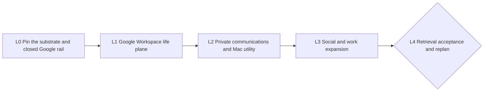

# Recall Universal Ingestion — Five-Loop Cascade

**Status:** approved for autonomous execution
**Mode:** BUILD
**Pacing:** autonomous between declared human gates
**RDD:** `docs/rdd/RECALL_UNIVERSAL_INGESTION_2026-07-16.md`

## Objective

Make Recall an owner-controlled context plane that safely ingests Google Workspace, local/private
communications, social activity, and work systems, then answers natural-language questions across
them with exact receipts, deletion lineage, and honest gaps.

Five loops are enough. They are outcome-sized integration gates, not a loop per connector. A loop may
ship several serial one-concern PRs, but it closes only when the combined eval/E2E is green. Every PR
uses red -> green -> refactor; every loop uses the full Cascade ribbon and has a hard bound.

## Operating contract

- Measure before changing behavior. L0 freezes the retrieval and safety baseline.
- Each loop follows RE-PLAN -> BUILD -> PIN -> PROVE -> MEASURE -> REVIEW -> MERGE -> EXIT.
- Maximum per PR: two failed PROVE runs and three review/fix rounds. Instrument failures are diagnosed
  separately and do not become fake evidence.
- A loop's public proof is synthetic or content-free. No message, event, contact, post, document,
  transcript, query, answer, credential, private export, selector, identifying path, or infrastructure
  detail enters a commit, PR, log, screenshot, or `EXIT.md`.
- Safety floors are always zero: secret/PII canary leak, unauthorized read/retrieval, cross-source
  authority escape, cursor advancement before Brain acknowledgement, deletion resurrection,
  unsupported deletion claim, arbitrary connector loading, and public exposure.
- Every model or judge call uses the approved staging LiteLLM router with a short-lived scoped virtual
  key. Direct provider calls and master-key use are prohibited.
- Each exit writes a mode-0600 private criterion map outside the repository, tied to merged HEAD, and
  publishes only content-free aggregate checks through CI or the PR. No Cascade diary or live evidence
  is committed. Each exit runs recap against the objective and records the ZEN result privately.
- Human gates wait without timing out. Hitting any other bound produces `status: AT_BOUND` and stops;
  it never weakens an exit.

## Task graph

| Task | `blockedBy` | Human gate |
|---|---|---|
| L0 | — | approve only the declared Google read-only scopes |
| L1 | L0 | complete Google OAuth consent |
| L2 | L1 | grant macOS permissions; WhatsApp is export-only in this chain |
| L3 | L2 | approve X streams/retention/cost and each additional external account scope |
| L4 | L3 | accept release or approve the successor chain |

## L0 — Pin the substrate and closed Google rail

- **goal:** Produce a closed, benchmarked ingestion substrate around pinned Google Workspace CLI
  `gws` v0.22.5 before connecting personal data.
- **prompt:** Read the RDD and current Recall connector/runtime code; freeze the unchanged retrieval,
  privacy, deletion, replay, and packaging baselines; red-test connector-v2 typed records, exact
  authority slots, ACK-gated checkpoints, revisions, tombstones, static registry preview, and rejection
  of arbitrary factories; pin `gws` v0.22.5 at tag commit `705fb0ec` with per-platform release
  checksums; expose only Gmail message/history reads, Calendar event reads, People connections reads,
  Drive change/file reads, and Docs exports through exact argv/method and response-schema allowlists;
  test non-interactive JSON stability, empty-success failure, revoke, read-only enforcement, untrusted
  content, crash replay, OS packaging, upgrade pinning, and credential isolation; then implement the
  closed rail boundary and shared contract in serial one-concern PRs.
- **accept:** The pre-change scorecard reproduces twice; all legacy connectors and the pinned `gws`
  rail pass the v2 conformance suite; duplicate pages and every injected crash converge to
  one acknowledged version; cursor-before-ACK, executable config, shell invocation, unknown command,
  write method, ambient environment, empty success, schema drift, and secret-bearing error tests fail
  closed; encrypted storage, backup/restore, filesystem mode, source-writer, and Tailnet-only
  attestations are green; repository tests and the public-safety scan pass at merged HEAD.
- **bound:** At most three serial PRs, two failed PROVE runs and three review rounds per PR, and ten
  working days total; checksum ambiguity or a failed storage/safety control exits AT_BOUND
  instead of authorizing Google data.
- **exit →:** Write the private criterion map, recap and pass ZEN, pause for owner approval of the
  declared Google scopes, then trigger L1.

## L1 — Google Workspace life plane

- **goal:** Deliver one continuously synchronized Google context plane—Gmail, Calendar, Contacts, and
  selected Drive/Docs—through the L0 rail with useful cited retrieval.
- **prompt:** After least-privilege OAuth consent, execute a repeated source ribbon for Gmail,
  Calendar, Contacts, Drive, and Docs: write failing synthetic contract/integration tests; add one
  narrow normalizer and authority implementation per PR; prove full backfill, incremental sync,
  pagination, overlap, quota/backoff, revoke, restart, edit, and authoritative deletion; for Gmail use
  history IDs and prefer Pub/Sub pull only as a wakeup, never as the canonical cursor; for Calendar use
  sync tokens and HTTP 410 reconciliation; for Contacts preserve ambiguous matches as candidates; for
  Drive/Docs preserve stable IDs, revisions, hierarchy, exports, and change checkpoints; shadow a
  bounded real account privately before searchable mode, then run frozen single-source and
  cross-Google questions. Attachments and Sheets content stay off unless separately approved.
- **accept:** Every enabled Google source is green in the synthetic connector-v2 matrix; two repeated
  full/incremental cycles plus every injected crash produce zero duplicate acknowledged versions;
  expired Gmail history, Calendar 410, Contacts token invalidation, and Drive change recovery lose no
  retained evidence; edits and authoritative deletes invalidate derived material; revoke stops reads
  and leaves only an ACK-recoverable spool; exact identifiers resolve while name-only contacts do not
  silently merge; at least 80% of each source's private frozen questions and 85% of the cross-Google
  set retrieve the expected evidence class, with valid canonical receipts for every material claim;
  public proof contains aggregate results only and every serial PR is merged and verified at HEAD.
- **bound:** At most five source PRs, two failed PROVE runs and three review rounds per PR, and fourteen
  working days total; one failing source may be explicitly disabled only by owner decision, otherwise
  the loop exits AT_BOUND without calling the Google plane complete.
- **exit →:** Write the private criterion map, recap and pass ZEN, then
  trigger L2; any loss, duplicate, receipt, revoke, scope, or privacy failure blocks private-message
  expansion.

## L2 — Private communications and Recall Bridge

- **goal:** Make the Mac utility safely operate all approved local/private collectors, including
  iMessage and the human-chosen WhatsApp mode, alongside existing coding and consented-export sources.
- **prompt:** Red-test a signed Recall Bridge clean install, upgrade, rollback, launch-on-login,
  sleep/wake, network partition, bounded spool, per-source pause/revoke/forget, Keychain references,
  content-free status, and uninstall; add the iMessage source as a pinned read-only snapshot/WAL reader
  with schema fixtures, edits, reactions, authoritative deletes, and attachment descriptors; add only
  a watched WhatsApp export inbox with stable archive/chat/message identities; route existing
  ChatGPT/Cowork consented exports and coding collectors through the same lifecycle UI without changing
  their evidence semantics; run a private clean-Mac E2E and frozen source questions, using one concern
  per serial PR.
- **accept:** Clean install, upgrade, rollback, sleep/wake, offline recovery, revoke, forget, and
  uninstall E2Es pass; the utility never opens iMessage writable, changes SIP, exposes a send surface,
  or displays content in diagnostics; repeated sync/import and every crash point yield zero duplicate
  versions for every enabled source; edits/deletes match frozen fixtures without claims based on list
  absence; lost permissions and revoke fail closed; WhatsApp never opens a linked-device session; at
  least 80% of private frozen questions per
  enabled source retrieve the expected conversation evidence with valid receipts; signed artifacts
  verify and public proof remains aggregate/content-free.
- **bound:** At most four serial PRs, two failed PROVE runs and three review rounds per PR, and fourteen
  working days total; two failed clean-device E2Es or unresolved WhatsApp export risk exits AT_BOUND
  rather than adding unsafe fallbacks.
- **exit →:** Write the private criterion map, recap and pass ZEN, pause for
  X and external-account scope decisions, then trigger L3.

## L3 — Social and work expansion

- **goal:** Prove Recall's source factory across the owner's approved social and work systems without
  introducing a generic recipe runner or broad agent credentials.
- **prompt:** Freeze an owner-prioritized list from X, Slack, Notion, GitHub, Linear, Telegram, and other
  official API/export sources; approve X stream types, retention, and cost ceiling first; execute the
  same source ribbon for no more than six sources, one connector per PR: failing conformance fixtures,
  exact read scopes, stable native IDs, incremental checkpoint or bounded reconciliation, rate/cost
  cutoff, edit/delete semantics, revoke, shadow, then private frozen questions; use official APIs,
  maintained bounded CLIs, or exports behind the closed rail contract, never browser sessions,
  arbitrary HTTP recipes, runtime plugins, or send/action surfaces; stop adding sources when the
  approved list or PR budget is exhausted and preserve the rest as measured successor candidates.
- **accept:** X and every other enabled source pass the full synthetic conformance and safety matrix;
  two repeated cycles and every crash restart yield zero duplicate versions; read scopes and source
  writers cannot cross accounts or sources; revoke and cost ceilings stop reads; authoritative
  edits/deletes invalidate projections within the frozen bound; each source reaches at least 80% on
  its private frozen evidence questions with receipt resolution 1.00; the factory proves at least two
  materially different acquisition shapes; all source PRs are merged at verified HEAD; omitted sources
  are ranked by measured question demand, acquisition method, privacy class, and estimated effort,
  with no private content in the repository.
- **bound:** No more than six serial source PRs, two failed PROVE runs and three review rounds per PR,
  and fifteen working days total; a failing or policy-blocked source is disabled and named in an
  AT_BOUND/replan verdict rather than weakening the factory or expanding credentials.
- **exit →:** Write the private criterion map, recap and pass ZEN, freeze the
  final cross-source eval set before inspecting results, then trigger L4.

## L4 — Cross-source retrieval, operations acceptance, and replan

- **goal:** Prove end-to-end natural-language recall across devices and sources, then obtain an owner
  release verdict and cut the next chain only from measured gaps.
- **prompt:** Freeze a private eval set spanning people, commitments, decisions, chronology,
  follow-ups, single-source, multi-source, temporal, contradictory, deleted, and insufficient-evidence
  cases; red-run it before ranking changes; improve query planning, source selection, identity/temporal
  graph traversal, conversation expansion, reranking, admission, citations, contradiction, and gap
  reporting one losing cluster at a time through the approved router; rerun all prior safety and source
  cells after each change; then run a private seven-day soak covering cross-device query, continuous
  sync, sleep/wake, network loss, credential revoke, deletion propagation, source forget, backup
  restore, and disaster recovery; draft a successor RDD/chain for only losing cells and deferred
  sources such as Notes, browser history, Photos metadata, selected files, attachments, or remaining
  work systems, and stop for owner review.
- **accept:** Every synthetic privacy, authorization, injection, deletion, contradiction, and citation
  cell passes; receipt resolution and deterministic repeated evidence selection are 1.00; the private
  frozen set reaches at least 85% expected-evidence recall and 80% owner-rated usefulness, improves
  multi-source recall by at least ten points over L0, and has no source-family regression greater than
  five points; the seven-day soak has no unresolved safety incident, data loss, duplicate storm, stuck
  cursor, unbounded spool, or public exposure, meets per-source lag SLO for 99% of observed intervals,
  and restores canonical/projection parity; a second approved device retrieves cited evidence; the
  successor document maps each proposal to a losing eval cell, safe acquisition method, privacy class,
  and hard E2E exit; the owner records accept, reject, or revise.
- **bound:** At most three ranking PRs, two failed PROVE runs and three review rounds per PR, one
  seven-day soak plus one remediation restart, and two successor drafts; owner sign-off waits unbounded
  by design, while a second soak failure exits AT_BOUND and stops release.
- **exit →:** Write the private criterion map, recap and pass ZEN, verify the
  deployed release commit and content-free verdict at HEAD, then stop at the final human gate; release
  only on explicit owner acceptance, otherwise start the approved remediation/successor chain.

## Review decision

Approving this document authorizes only these five bounded outcomes and their serial one-concern PRs.
It does not authorize broad OAuth presets, write/send tools, public Brain ingress, attachment content,
WhatsApp linked-device access, durable home-timeline retention, or additional accounts without their
named human gates.
