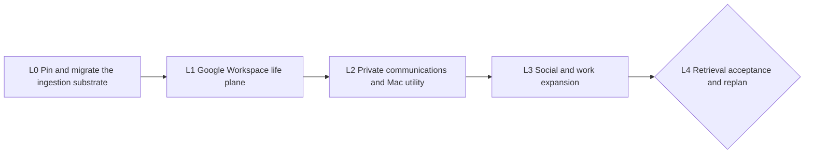

# Recall Universal Ingestion — Five-Loop Cascade

**Status:** replanned after L0 AT_BOUND; approved for autonomous remediation through human gates
**Mode:** BUILD
**Pacing:** autonomous between declared human gates
**RDD:** `docs/rdd/RECALL_UNIVERSAL_INGESTION_2026-07-16.md`
**Replan issue:** [#54 — managed Postgres deployment](https://github.com/miguelrios/unc-skills/issues/54)

## Objective

Make Recall an owner-controlled context plane that safely ingests Google Workspace, local/private
communications, social activity, and work systems, then answers natural-language questions across
them with exact receipts, deletion lineage, and honest gaps.

Five loops are enough. They are outcome-sized integration gates, not a loop per connector. A loop may
ship several serial one-concern PRs, but it closes only when the combined eval/E2E is green. Every PR
uses red -> green -> refactor; every loop uses the full Cascade ribbon and has a hard bound.

## Operating contract

- Measure before changing behavior. L0 preserves the frozen retrieval/safety baseline while moving
  the central plane onto an encrypted, restore-tested managed deployment.
- Each loop follows RE-PLAN -> BUILD -> PIN -> PROVE -> MEASURE -> REVIEW -> MERGE -> EXIT.
- Maximum per PR: two failed PROVE runs and three review/fix rounds. Instrument failures are diagnosed
  separately and do not become fake evidence.
- A loop's public proof is synthetic or content-free. No message, event, contact, post, document,
  transcript, query, answer, credential, private export, selector, identifying path, or infrastructure
  detail enters a commit, PR, log, screenshot, or `EXIT.md`.
- Safety floors are always zero: secret/PII canary leak, unauthorized read/retrieval, cross-source
  authority escape, cursor advancement before Brain acknowledgement, deletion resurrection,
  unsupported deletion claim, arbitrary connector loading, and public exposure.
- Every model or judge call uses the approved staging LiteLLM router with a short-lived scoped virtual
  key. Direct provider calls and master-key use are prohibited.
- Each exit writes a mode-0600 private criterion map outside the repository, tied to merged HEAD, and
  publishes only content-free aggregate checks through CI or the PR. No Cascade diary or live evidence
  is committed. Each exit runs recap against the objective and records the ZEN result privately.
- Human gates wait without timing out. Hitting any other bound produces `status: AT_BOUND` and stops;
  it never weakens an exit.

## Task graph

| Task | `blockedBy` | Human gate |
|---|---|---|
| L0 | — | approve provider billing/region, provider credential grants, Tailnet route, final cutover, then only the declared Google read-only scopes |
| L1 | L0 | complete Google OAuth consent |
| L2 | L1 | grant macOS permissions; WhatsApp is export-only in this chain |
| L3 | L2 | approve X streams/retention/cost and each additional external account scope |
| L4 | L3 | accept release or approve the successor chain |

## L0 — Pin and migrate the ingestion substrate

- **goal:** Finish the already-merged closed connector substrate by moving the central Brain onto an
  agent-deployable, encrypted, restore-tested managed Postgres deployment before connecting any new
  personal source.
- **prompt:** Start from Issue #54, the RDD, merged PR #53, the frozen pre-change scorecard, and current
  Recall deployment contract. Preserve the connector-v2 typed records, static registry, ACK-gated
  revisions/tombstones, pinned `gws` v0.22.5 rail, retrieval behavior, privacy boundary, and package
  surfaces. Red-test an immutable `recall-core` container, standard-Postgres capability probe,
  restartable migrations, least-privilege application/migration roles, encrypted connector durability,
  and a closed deployment manifest that contains references rather than credential values. Implement
  the first agent-managed profile as PlanetScale Postgres plus a Render private service and Tailscale
  gateway; the application must consume standard `DATABASE_URL` semantics and provider-neutral SQL so
  Supabase, Neon, and conforming pgvector Postgres remain substitutable profiles. Move always-on
  connector outbox/checkpoint durability into Postgres or another provider-attested encrypted boundary;
  local collectors retain private device spools and never receive database credentials. Provisioning
  may preview automatically but must pause for billing, region, provider authorization, Tailnet route,
  and cutover approval. Prove backup/restore into an isolated target, extension recreation, canonical
  event/revision/tombstone/receipt/projection parity, fault-injected final delta, endpoint rotation,
  second-device retrieval, and rollback before decommissioning the old writer. No live Google OAuth,
  reads, or backfill occur in L0.
- **accept:**
  1. The twice-reproduced baseline and every merged connector/rail conformance cell remain green.
  2. The same immutable container passes a standard pgvector fixture and the PlanetScale pilot
     capability probe with zero provider-specific SQL or canonical behavior differences.
  3. A fresh-account deployment dry-run is content-free, idempotent, agent-runnable, makes zero
     billable mutations, and pauses at every declared human grant; after approval, two applies converge
     to the same manifest with zero duplicate resources or credential values rendered.
  4. Provider APIs attest encryption at rest for the database, backups, and connector durability;
     connection tests fail when TLS verification is disabled or server identity does not match.
  5. Restore into an isolated target recreates required extensions and reaches exact canonical-event,
     revision, tombstone, receipt, grant, source-profile, projection, and embedding parity.
  6. Two synthetic cutover cycles plus crash-after-copy, crash-after-Brain-ACK, restart, network-loss,
     revoke, and rollback faults produce zero missing live records, duplicate acknowledged versions,
     resurrected deletions, cross-source authority changes, or cursor commits before ACK.
  7. Existing Linux and Mac collectors ingest and retrieve cited synthetic evidence after cutover; a
     second approved device retrieves the same evidence and resolves every receipt.
  8. The User #1 Tailnet profile has zero public Recall listeners, and an external non-Tailnet probe
     cannot reach the service.
  9. Backup restore, credential rotation/revoke, process restart, rollback, repository tests,
     deployment E2Es, container/supply-chain scan, and public-safety scan pass at merged and deployed
     HEAD with content-free aggregate output.
- **bound:** At most four total serial L0 PRs including merged PR #53, two failed PROVE runs and three
  review rounds per PR, one cutover plus one remediation restart, and fourteen working days from this
  replan. A failed encryption, parity, restore, rollback, authorization, or exposure control writes a
  private `AT_BOUND` criterion map and stops without authorizing Google data.
- **exit →:** Write the mode-0600 private criterion map tied to merged and deployed HEAD, run recap and
  pass ZEN, obtain owner acceptance of the cutover and the four declared Google read-only scopes, then
  trigger L1.

## L1 — Google Workspace life plane

- **goal:** Deliver one continuously synchronized Google context plane—Gmail, Calendar, Contacts, and
  selected Drive/Docs—through the L0 rail with useful cited retrieval.
- **prompt:** After least-privilege OAuth consent, execute a repeated source ribbon for Gmail,
  Calendar, Contacts, Drive, and Docs: write failing synthetic contract/integration tests; add one
  narrow normalizer and authority implementation per PR; prove full backfill, incremental sync,
  pagination, overlap, quota/backoff, revoke, restart, edit, and authoritative deletion; for Gmail use
  history IDs and prefer Pub/Sub pull only as a wakeup, never as the canonical cursor; for Calendar use
  sync tokens and HTTP 410 reconciliation; for Contacts preserve ambiguous matches as candidates; for
  Drive/Docs preserve stable IDs, revisions, hierarchy, exports, and change checkpoints; shadow a
  bounded real account privately before searchable mode, then run frozen single-source and
  cross-Google questions. Attachments and Sheets content stay off unless separately approved.
- **accept:** Every enabled Google source is green in the synthetic connector-v2 matrix; two repeated
  full/incremental cycles plus every injected crash produce zero duplicate acknowledged versions;
  expired Gmail history, Calendar 410, Contacts token invalidation, and Drive change recovery lose no
  retained evidence; edits and authoritative deletes invalidate derived material; revoke stops reads
  and leaves only an ACK-recoverable spool; exact identifiers resolve while name-only contacts do not
  silently merge; at least 80% of each source's private frozen questions and 85% of the cross-Google
  set retrieve the expected evidence class, with valid canonical receipts for every material claim;
  public proof contains aggregate results only and every serial PR is merged and verified at HEAD.
- **bound:** At most five source PRs, two failed PROVE runs and three review rounds per PR, and fourteen
  working days total; one failing source may be explicitly disabled only by owner decision, otherwise
  the loop exits AT_BOUND without calling the Google plane complete.
- **exit →:** Write the private criterion map, recap and pass ZEN, then
  trigger L2; any loss, duplicate, receipt, revoke, scope, or privacy failure blocks private-message
  expansion.

## L2 — Private communications and Recall Bridge

- **goal:** Make the Mac utility safely operate all approved local/private collectors, including
  iMessage and the human-chosen WhatsApp mode, alongside existing coding and consented-export sources.
- **prompt:** Red-test a signed Recall Bridge clean install, upgrade, rollback, launch-on-login,
  sleep/wake, network partition, bounded spool, per-source pause/revoke/forget, Keychain references,
  content-free status, and uninstall; add the iMessage source as a pinned read-only snapshot/WAL reader
  with schema fixtures, edits, reactions, authoritative deletes, and attachment descriptors; add only
  a watched WhatsApp export inbox with stable archive/chat/message identities; route existing
  ChatGPT/Cowork consented exports and coding collectors through the same lifecycle UI without changing
  their evidence semantics; run a private clean-Mac E2E and frozen source questions, using one concern
  per serial PR.
- **accept:** Clean install, upgrade, rollback, sleep/wake, offline recovery, revoke, forget, and
  uninstall E2Es pass; the utility never opens iMessage writable, changes SIP, exposes a send surface,
  or displays content in diagnostics; repeated sync/import and every crash point yield zero duplicate
  versions for every enabled source; edits/deletes match frozen fixtures without claims based on list
  absence; lost permissions and revoke fail closed; WhatsApp never opens a linked-device session; at
  least 80% of private frozen questions per
  enabled source retrieve the expected conversation evidence with valid receipts; signed artifacts
  verify and public proof remains aggregate/content-free.
- **bound:** At most four serial PRs, two failed PROVE runs and three review rounds per PR, and fourteen
  working days total; two failed clean-device E2Es or unresolved WhatsApp export risk exits AT_BOUND
  rather than adding unsafe fallbacks.
- **exit →:** Write the private criterion map, recap and pass ZEN, pause for
  X and external-account scope decisions, then trigger L3.

## L3 — Social and work expansion

- **goal:** Prove Recall's source factory across the owner's approved social and work systems without
  introducing a generic recipe runner or broad agent credentials.
- **prompt:** Freeze an owner-prioritized list from X, Slack, Notion, GitHub, Linear, Telegram, and other
  official API/export sources; approve X stream types, retention, and cost ceiling first; execute the
  same source ribbon for no more than six sources, one connector per PR: failing conformance fixtures,
  exact read scopes, stable native IDs, incremental checkpoint or bounded reconciliation, rate/cost
  cutoff, edit/delete semantics, revoke, shadow, then private frozen questions; use official APIs,
  maintained bounded CLIs, or exports behind the closed rail contract, never browser sessions,
  arbitrary HTTP recipes, runtime plugins, or send/action surfaces; stop adding sources when the
  approved list or PR budget is exhausted and preserve the rest as measured successor candidates.
- **accept:** X and every other enabled source pass the full synthetic conformance and safety matrix;
  two repeated cycles and every crash restart yield zero duplicate versions; read scopes and source
  writers cannot cross accounts or sources; revoke and cost ceilings stop reads; authoritative
  edits/deletes invalidate projections within the frozen bound; each source reaches at least 80% on
  its private frozen evidence questions with receipt resolution 1.00; the factory proves at least two
  materially different acquisition shapes; all source PRs are merged at verified HEAD; omitted sources
  are ranked by measured question demand, acquisition method, privacy class, and estimated effort,
  with no private content in the repository.
- **bound:** No more than six serial source PRs, two failed PROVE runs and three review rounds per PR,
  and fifteen working days total; a failing or policy-blocked source is disabled and named in an
  AT_BOUND/replan verdict rather than weakening the factory or expanding credentials.
- **exit →:** Write the private criterion map, recap and pass ZEN, freeze the
  final cross-source eval set before inspecting results, then trigger L4.

## L4 — Cross-source retrieval, operations acceptance, and replan

- **goal:** Prove end-to-end natural-language recall across devices and sources, then obtain an owner
  release verdict and cut the next chain only from measured gaps.
- **prompt:** Freeze a private eval set spanning people, commitments, decisions, chronology,
  follow-ups, single-source, multi-source, temporal, contradictory, deleted, and insufficient-evidence
  cases; red-run it before ranking changes; improve query planning, source selection, identity/temporal
  graph traversal, conversation expansion, reranking, admission, citations, contradiction, and gap
  reporting one losing cluster at a time through the approved router; rerun all prior safety and source
  cells after each change; then run a private seven-day soak covering cross-device query, continuous
  sync, sleep/wake, network loss, credential revoke, deletion propagation, source forget, backup
  restore, and disaster recovery; draft a successor RDD/chain for only losing cells and deferred
  sources such as Notes, browser history, Photos metadata, selected files, attachments, or remaining
  work systems, and stop for owner review.
- **accept:** Every synthetic privacy, authorization, injection, deletion, contradiction, and citation
  cell passes; receipt resolution and deterministic repeated evidence selection are 1.00; the private
  frozen set reaches at least 85% expected-evidence recall and 80% owner-rated usefulness, improves
  multi-source recall by at least ten points over L0, and has no source-family regression greater than
  five points; the seven-day soak has no unresolved safety incident, data loss, duplicate storm, stuck
  cursor, unbounded spool, or public exposure, meets per-source lag SLO for 99% of observed intervals,
  and restores canonical/projection parity; a second approved device retrieves cited evidence; the
  successor document maps each proposal to a losing eval cell, safe acquisition method, privacy class,
  and hard E2E exit; the owner records accept, reject, or revise.
- **bound:** At most three ranking PRs, two failed PROVE runs and three review rounds per PR, one
  seven-day soak plus one remediation restart, and two successor drafts; owner sign-off waits unbounded
  by design, while a second soak failure exits AT_BOUND and stops release.
- **exit →:** Write the private criterion map, recap and pass ZEN, verify the
  deployed release commit and content-free verdict at HEAD, then stop at the final human gate; release
  only on explicit owner acceptance, otherwise start the approved remediation/successor chain.

## Review decision

Approving this document authorizes only these five bounded outcomes and their serial one-concern PRs.
It does not authorize broad OAuth presets, write/send tools, public Brain ingress, attachment content,
WhatsApp linked-device access, durable home-timeline retention, or additional accounts without their
named human gates.

## Replan record — 2026-07-16

L0's connector-v2 substrate and pinned Workspace rail merged in PR #53, but the operational storage
attestation could not prove the encryption floor, so L0 stopped `AT_BOUND` before Google
authorization. The owner chose migration before live source expansion. Issue #54 is therefore folded
into L0 as its remediation phase rather than added as a sixth loop. L1 through L4 retain their order,
scope, quality floors, and human gates; only L0's central deployment, migration, and cutover work is
expanded. No new personal source may be enabled until the revised L0 exit is complete.

## Replan record — 2026-07-17

The owner determined that Grep agents run in sandboxes outside the Tailnet, so Tailnet-only ingress
cannot satisfy the primary MCP use case. No new source loop had begun. The unfinished L0 and the
unchanged L1–L4 outcomes continue in the append-forward successor
`docs/LOOP_CHAIN_RECALL_PUBLIC_MCP_AND_UNIVERSAL_INGESTION_2026-07-17.md`. The successor replaces the
Tailnet-only acceptance row with a public HTTPS MCP boundary, explicit principal/capability
authorization, dedicated Render egress, a PlanetScale allowlist, and a real Grep-sandbox E2E. This
document remains the historical record and is not executed further.
